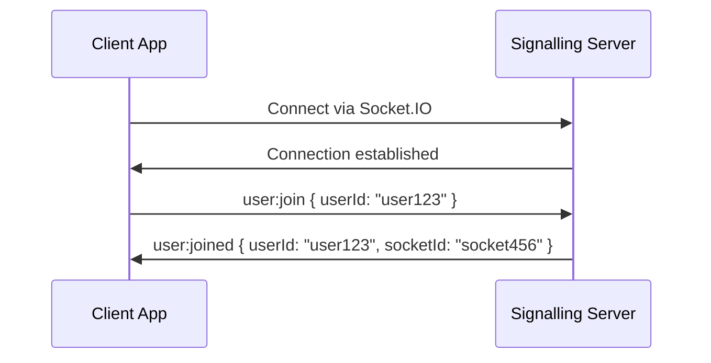
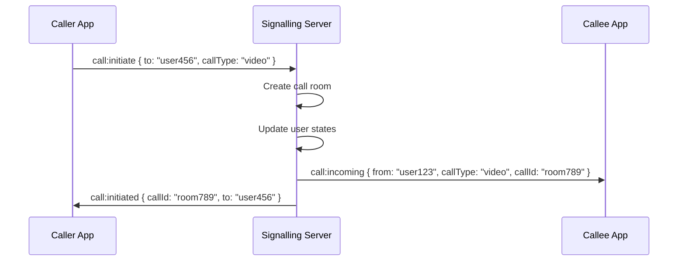
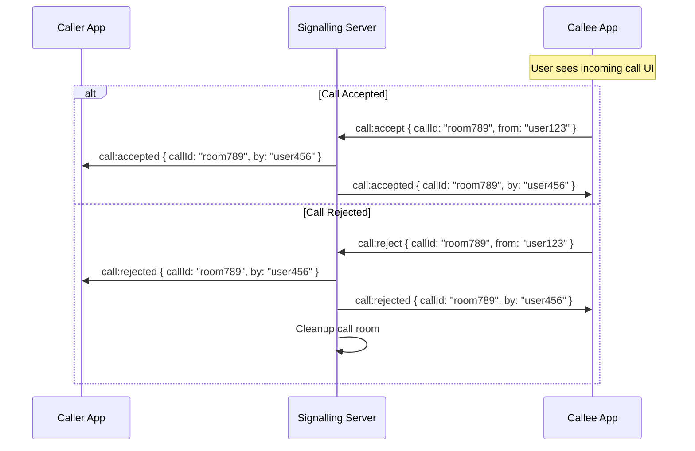
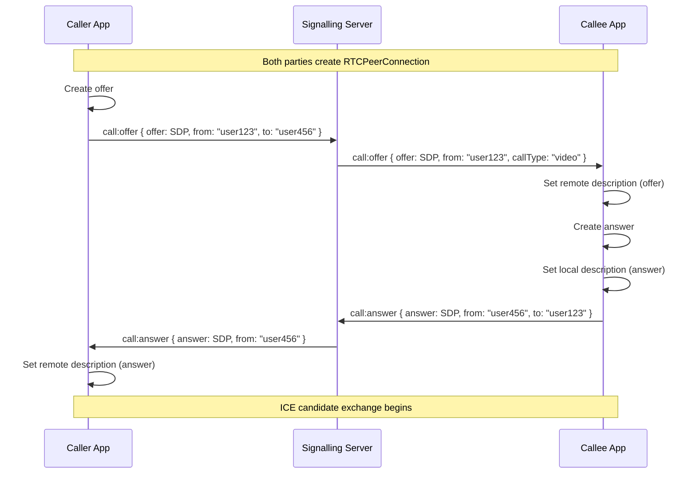
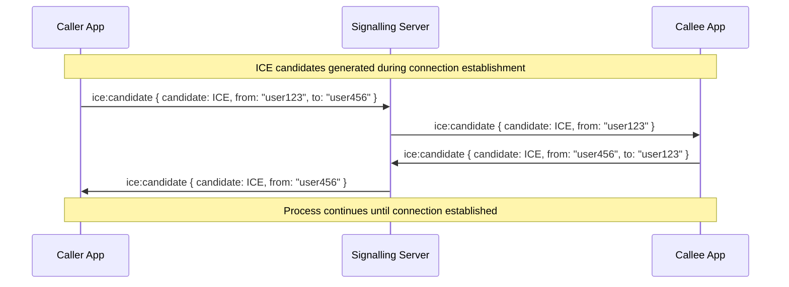
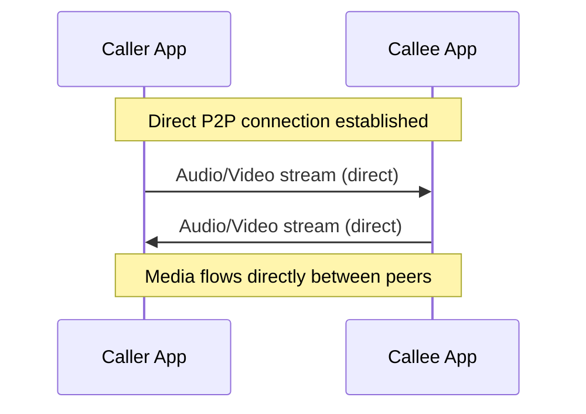
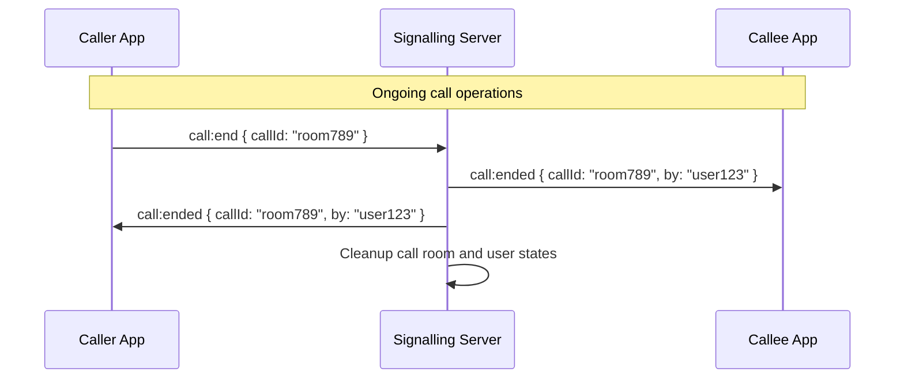
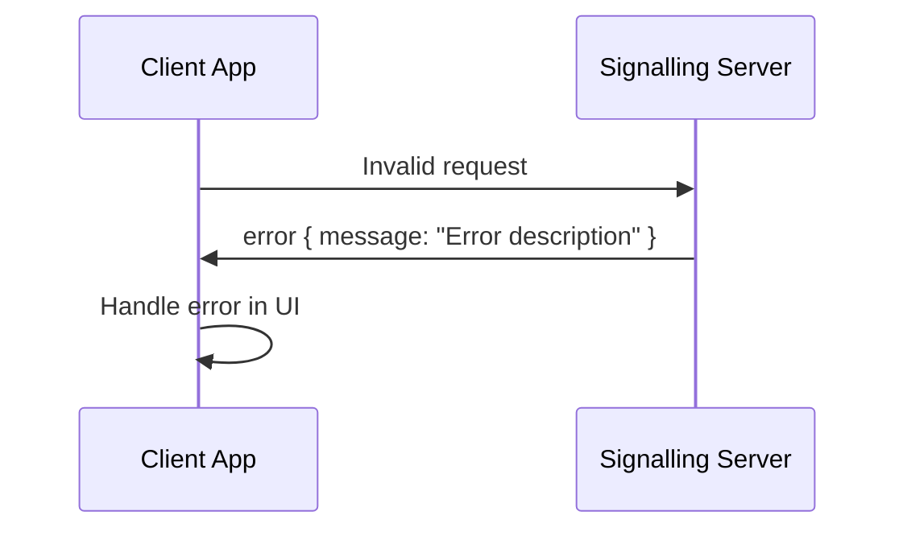
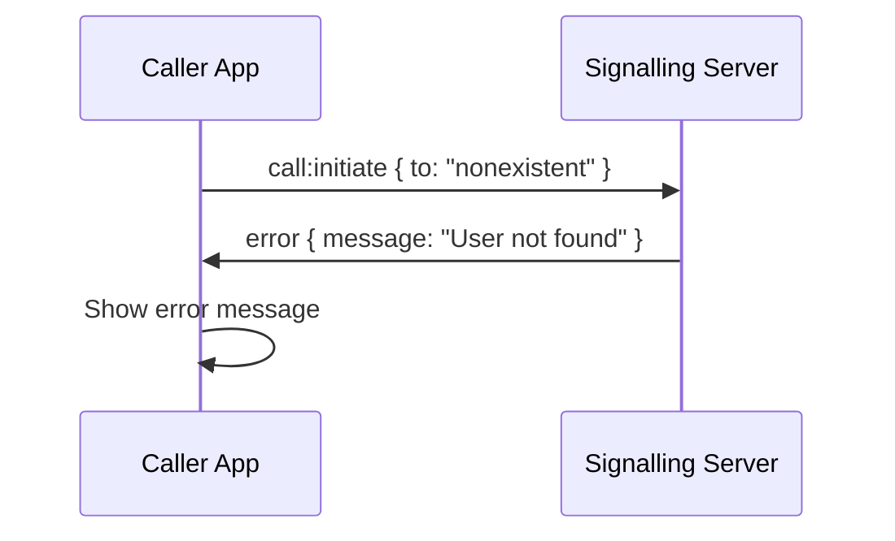

# WebRTC Call Workflow

This document describes the complete workflow of WebRTC calls through the signalling server, from connection establishment to call termination.

## Overview

The WebRTC calling system follows this general flow:

1. **Connection Setup** - Users connect to the signalling server
2. **Call Initiation** - One user initiates a call to another
3. **Call Acceptance** - The recipient accepts or rejects the call
4. **WebRTC Signalling** - Exchange of SDP offers/answers and ICE candidates
5. **Media Stream Establishment** - Direct peer-to-peer connection
6. **Call Management** - Ongoing call operations
7. **Call Termination** - Call ending and cleanup

## Detailed Workflow

### 1. Connection Setup Phase



**What happens:**

- Client establishes WebSocket connection to signalling server
- Client sends `user:join` with their user ID
- Server creates user session and maps socket ID to user ID
- Server confirms successful join

**Server-side code:**

```typescript
socket.on("user:join", (data: { userId: string }) => {
  // Validate user ID
  if (!data.userId) {
    socket.emit("error", { message: "User ID is required" });
    return;
  }

  // Create user session
  const user: User = {
    id: data.userId,
    socketId: socket.id,
    isInCall: false,
  };

  users.set(data.userId, user);
  socketToUser.set(socket.id, data.userId);

  socket.emit("user:joined", { userId: data.userId, socketId: socket.id });
});
```

### 2. Call Initiation Phase



**What happens:**

- Caller requests to initiate a call to a specific user
- Server validates both users are available
- Server creates a call room and updates user states
- Server notifies callee about incoming call
- Server confirms call initiation to caller

**Server-side code:**

```typescript
socket.on(
  "call:initiate",
  (data: { to: string; callType: "audio" | "video" }) => {
    const caller = getUserBySocketId(socket.id);

    // Validate caller and callee
    if (!caller || !isUserAvailable(data.to)) {
      socket.emit("error", { message: "User not available" });
      return;
    }

    // Create call room
    const callId = createCallId(caller.id, data.to);
    const callRoom: CallRoom = {
      id: callId,
      participants: [caller.id, data.to],
      isActive: true,
      createdAt: new Date(),
    };

    callRooms.set(callId, callRoom);

    // Update user states
    caller.isInCall = true;
    caller.currentCallId = callId;

    // Notify callee
    const callee = users.get(data.to);
    if (callee) {
      const calleeSocket = io.sockets.sockets.get(callee.socketId);
      calleeSocket?.emit("call:incoming", {
        from: caller.id,
        callType: data.callType,
        callId,
      });
    }

    socket.emit("call:initiated", { callId, to: data.to });
  }
);
```

### 3. Call Acceptance/Rejection Phase



**What happens:**

- Callee receives incoming call notification
- Callee can accept or reject the call
- If accepted, both parties are notified and call proceeds
- If rejected, call is terminated and resources are cleaned up

**Server-side code:**

```typescript
// Accept call
socket.on("call:accept", (data: { callId: string; from: string }) => {
  const callee = getUserBySocketId(socket.id);
  const callRoom = callRooms.get(data.callId);

  if (!callRoom || !callRoom.isActive) {
    socket.emit("error", { message: "Call not found or expired" });
    return;
  }

  // Notify caller
  const caller = users.get(data.from);
  if (caller) {
    const callerSocket = io.sockets.sockets.get(caller.socketId);
    callerSocket?.emit("call:accepted", { callId: data.callId, by: callee.id });
  }

  socket.emit("call:accepted", { callId: data.callId, by: callee.id });
});

// Reject call
socket.on("call:reject", (data: { callId: string; from: string }) => {
  const callee = getUserBySocketId(socket.id);

  // Notify caller
  const caller = users.get(data.from);
  if (caller) {
    const callerSocket = io.sockets.sockets.get(caller.socketId);
    callerSocket?.emit("call:rejected", { callId: data.callId, by: callee.id });
  }

  // Cleanup call
  cleanupCall(data.callId);
  socket.emit("call:rejected", { callId: data.callId, by: callee.id });
});
```

### 4. WebRTC Signalling Phase



**What happens:**

- Both parties create RTCPeerConnection objects
- Caller creates and sends SDP offer
- Callee receives offer, sets it as remote description
- Callee creates and sends SDP answer
- Caller receives answer, sets it as remote description
- ICE candidate exchange begins

**Server-side code:**

```typescript
// Handle SDP offer
socket.on("call:offer", (data: CallOffer) => {
  const sender = getUserBySocketId(socket.id);
  const receiver = users.get(data.to);

  if (!sender || !receiver) {
    socket.emit("error", { message: "User not found" });
    return;
  }

  // Forward offer to receiver
  const receiverSocket = io.sockets.sockets.get(receiver.socketId);
  receiverSocket?.emit("call:offer", {
    offer: data.offer,
    from: sender.id,
    callType: data.callType,
  });
});

// Handle SDP answer
socket.on("call:answer", (data: CallAnswer) => {
  const sender = getUserBySocketId(socket.id);
  const receiver = users.get(data.to);

  if (!sender || !receiver) {
    socket.emit("error", { message: "User not found" });
    return;
  }

  // Forward answer to receiver
  const receiverSocket = io.sockets.sockets.get(receiver.socketId);
  receiverSocket?.emit("call:answer", {
    answer: data.answer,
    from: sender.id,
  });
});
```

### 5. ICE Candidate Exchange Phase



**What happens:**

- ICE candidates are generated as the peer connection tries to establish connectivity
- Each candidate is sent to the remote peer through the signalling server
- Remote peer adds each candidate to their peer connection
- Process continues until a successful connection path is found

**Server-side code:**

```typescript
socket.on("ice:candidate", (data: IceCandidate) => {
  const sender = getUserBySocketId(socket.id);
  const receiver = users.get(data.to);

  if (!sender || !receiver) {
    socket.emit("error", { message: "User not found" });
    return;
  }

  // Forward ICE candidate to receiver
  const receiverSocket = io.sockets.sockets.get(receiver.socketId);
  receiverSocket?.emit("ice:candidate", {
    candidate: data.candidate,
    from: sender.id,
  });
});
```

### 6. Media Stream Establishment



**What happens:**

- Once ICE candidates are exchanged and a path is found, direct P2P connection is established
- Media streams flow directly between peers, bypassing the signalling server
- Signalling server is no longer involved in media transmission
- Connection quality depends on network conditions between peers

### 7. Call Management Phase



**What happens:**

- During the call, either party can end it
- Server notifies both parties when call ends
- Server cleans up call room and resets user states
- Both parties cleanup their WebRTC resources

**Server-side code:**

```typescript
socket.on("call:end", (data: { callId: string }) => {
  const user = getUserBySocketId(socket.id);
  const callRoom = callRooms.get(data.callId);

  if (!callRoom) {
    socket.emit("error", { message: "Call not found" });
    return;
  }

  // Notify all participants
  callRoom.participants.forEach((participantId) => {
    if (participantId !== user.id) {
      const participant = users.get(participantId);
      if (participant) {
        const participantSocket = io.sockets.sockets.get(participant.socketId);
        participantSocket?.emit("call:ended", {
          callId: data.callId,
          by: user.id,
        });
      }
    }
  });

  // Cleanup call
  cleanupCall(data.callId);
  socket.emit("call:ended", { callId: data.callId, by: user.id });
});
```

## Error Handling Workflow

### Connection Errors



### Call Errors



## State Transitions

### User States

```
OFFLINE → ONLINE → IN_CALL → ONLINE → OFFLINE
```

### Call States

```
IDLE → INITIATING → RINGING → CONNECTING → CONNECTED → ENDING → IDLE
```

## Timeout Handling

### Call Timeout

- Incoming calls have a configurable timeout (e.g., 30 seconds)
- If not answered within timeout, call is automatically rejected
- Server sends timeout notification to caller

### Connection Timeout

- Socket connections have heartbeat/ping mechanisms
- Inactive connections are automatically cleaned up
- Users are marked as offline after timeout

## Security Considerations

### Authentication

- Users must provide valid user ID to join
- Server validates user identity before allowing operations
- Unauthorized requests are rejected with error messages

### Rate Limiting

- Implement rate limiting for call initiation
- Prevent spam calls and abuse
- Monitor and log suspicious activity

### Data Validation

- All incoming data is validated
- Malformed requests are rejected
- Input sanitization prevents injection attacks

## Monitoring and Logging

### Server Logs

- All connection events are logged
- Call events are tracked with timestamps
- Error conditions are logged with context

### Metrics

- Active connections count
- Call success/failure rates
- Average call duration
- Peak concurrent calls

## Troubleshooting

### Common Issues

1. **Call not connecting**

   - Check ICE server configuration
   - Verify firewall settings
   - Check network connectivity

2. **Audio/video not working**

   - Verify media permissions
   - Check device availability
   - Test with different browsers

3. **Connection drops**
   - Implement reconnection logic
   - Check network stability
   - Monitor connection quality

### Debug Tools

- Browser WebRTC internals
- Network tab in DevTools
- Server-side logging
- Client-side error reporting
